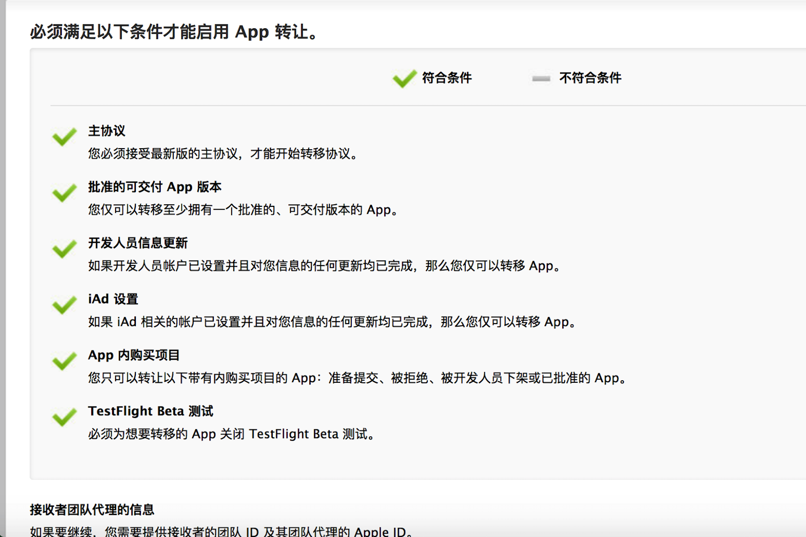
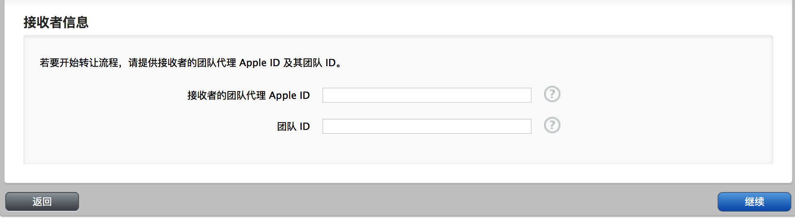
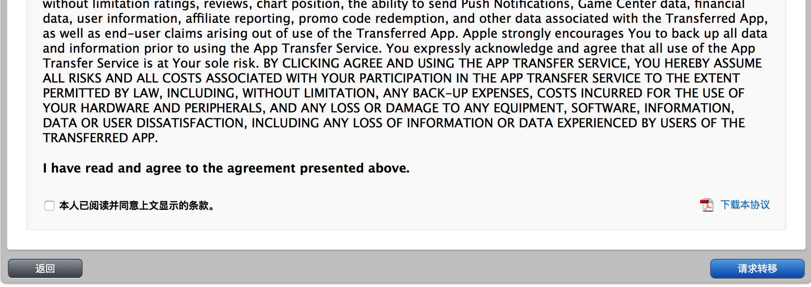
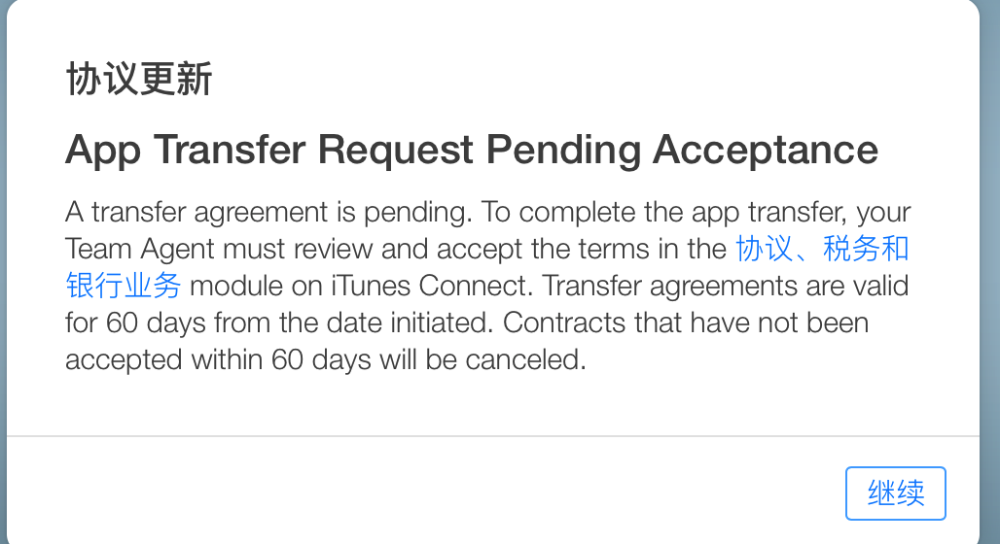
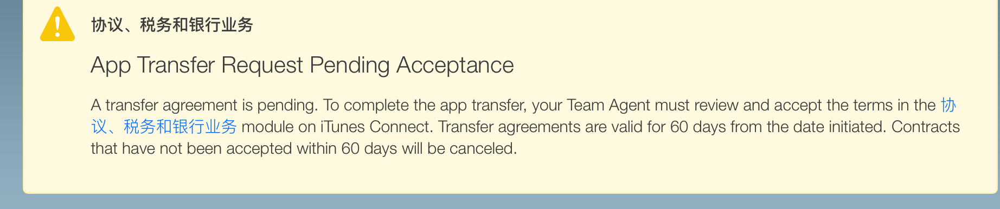
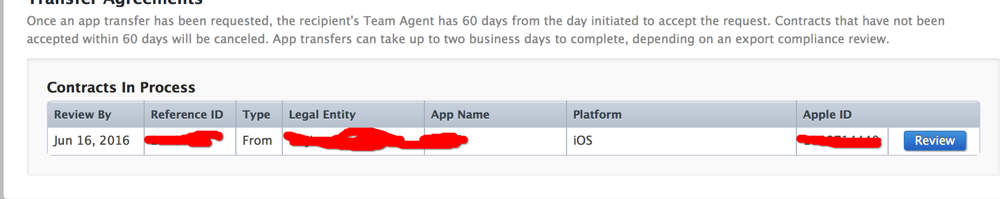

# transfer-app
appstore中app的转移
 步骤如下:

###首先会检测app是否满足转移条件

###Apple ID 就是要转入的开发者账号 团队ID 也是要转入的账户的 在账户个人信息的account里面可以看到

###转移完成

###登陆接收的账号 进入iTunes connect 会看下下面提示 点击蓝色字体

###点击review

###填入新的app信息

###至此转移完成 注意查看邮件
